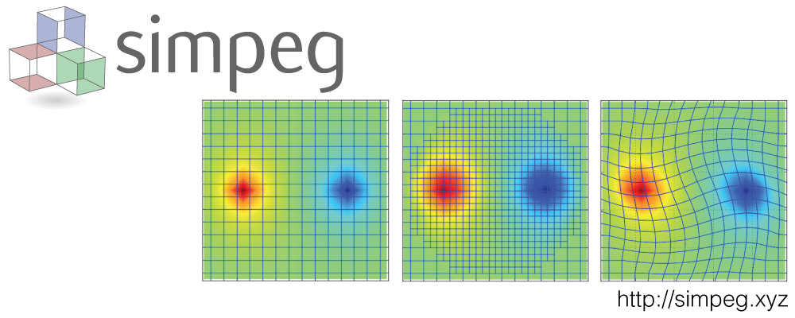

# An open source framework for simulation and gradient based parameter estimation in geophysical applications 

_ Rowan Cockett, Seogi Kang, Lindsey J. Heagy, Adam Pidlisecky and Douglas W. Oldenburg_

(https://doi.org/10.1016/j.cageo.2015.09.015)



## Summary

Inverse modeling is a powerful tool for extracting information about the subsurface from geophysical data. Geophysical inverse problems are inherently multidisciplinary, requiring elements from the relevant physics, numerical simulation, and optimization, as well as knowledge of the geologic setting, and a comprehension of the interplay between all of these elements. The development and advancement of inversion methodologies can be enabled by a framework that supports experimentation, is flexible and extensible, and allows the knowledge generated to be captured and shared. The goal of this paper is to propose a framework that supports many different types of geophysical forward simulations and deterministic inverse problems. Additionally, we provide an open source implementation of this framework in Python called \SimPEG (Simulation and Parameter Estimation in Geophysics, http://simpeg.xyz). Included in \SimPEG are staggered grid, mimetic finite volume discretizations on a number of structured and semi-structured meshes, convex optimization programs, inversion routines, model parameterizations, useful utility codes, and interfaces to standard numerical solver packages. The framework and implementation are modular, allowing the user to explore, experiment with, and iterate over a variety of approaches to the inverse problem. \SimPEG provides an extensible, documented, and well-tested framework for inverting many types of geophysical data and thereby helping to answer questions in geoscience applications. Throughout the paper we use a generic direct current resistivity problem to illustrate the framework and functionality of \SimPEG.
 

## Citation

Cockett, R., Kang, S., Heagy, L. J., Pidlisecky, A., & Oldenburg, D. W. (2015). SimPEG: An open source framework for simulation and gradient based parameter estimation in geophysical applications. Computers & Geosciences, 85, 142–154. https://doi.org/10.1016/j.cageo.2015.09.015

```
@article{cockett_gradient_2015,
title = {SimPEG: An open source framework for simulation and gradient based parameter estimation in geophysical applications},
author = {Rowan Cockett and Seogi Kang and Lindsey J. Heagy and Adam Pidlisecky and Douglas W. Oldenburg},
journal = {Computers & Geosciences},
volume = {85},
pages = {142-154},
year = {2015},
issn = {0098-3004},
doi = {https://doi.org/10.1016/j.cageo.2015.09.015},
url = {https://www.sciencedirect.com/science/article/pii/S009830041530056X},
}

```
